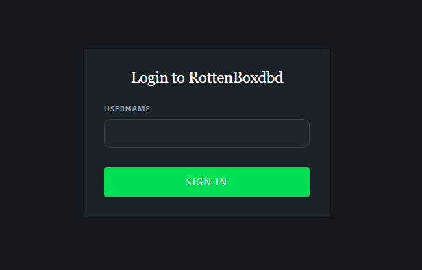
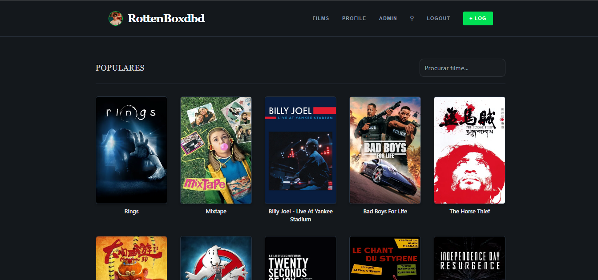
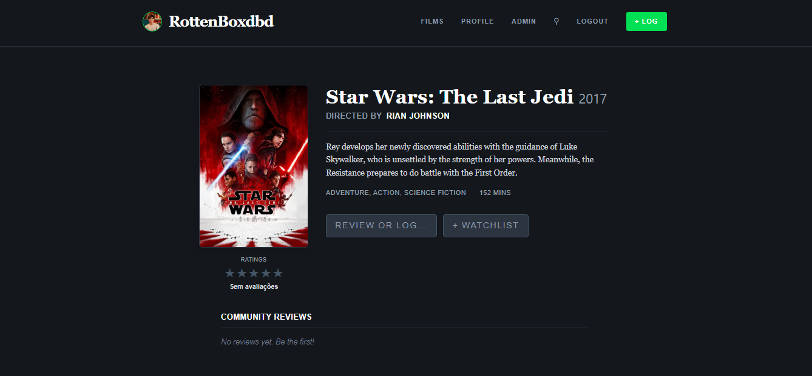
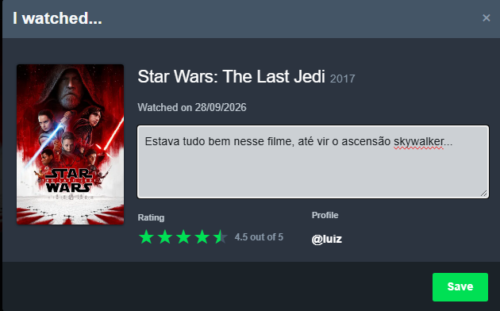
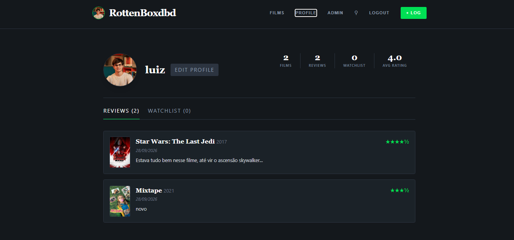
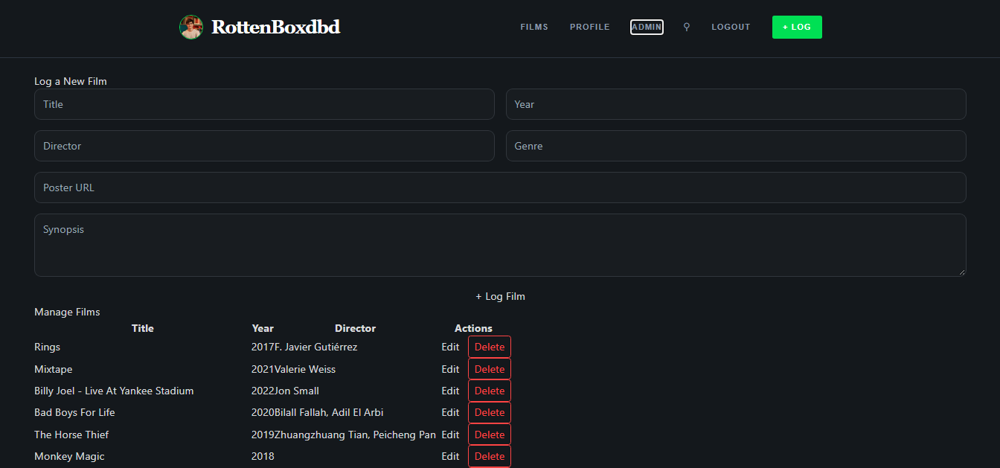

<p align="center">
  
</p>

<h1 align="center">RottenBoxdbd</h1>

<p align="center">
  Plataforma full-stack de avaliação de filmes inspirada no <strong>Letterboxd</strong>.<br/>
  Atividade DEV do <strong>Visagio Rocket Lab 2026.2</strong>.
</p>

<p align="center">
  
  
  
  
  
  
  
</p>

---

## Sumário

- [Sobre o projeto](#sobre-o-projeto)
- [Funcionalidades](#funcionalidades)
- [Demonstração](#demonstração)
- [Tecnologias](#tecnologias)
- [Arquitetura e organização](#arquitetura-e-organização)
- [Modelo de dados](#modelo-de-dados)
- [Endpoints da API](#endpoints-da-api)
- [Como executar](#como-executar)
- [Testes](#testes)
- [Padrão de commits](#padrão-de-commits)
- [Autor](#autor)

---

## Sobre o projeto

O **RottenBoxdbd** é um sistema de avaliação de filmes em que o usuário navega por um catálogo, abre os detalhes de cada filme, registra notas e resenhas, monta uma watchlist com o que quer assistir e acompanha tudo no próprio perfil. O visual e os fluxos seguem o Letterboxd: tema escuro, pôsteres em destaque, estrelas verdes e o modal **"I watched..."** para registrar um filme.

O projeto partiu da estrutura base fornecida pelo Rocket Lab (modelos SQLAlchemy, Alembic e arquivos `.csv` com dados reais de filmes). Os dados vêm desses CSVs: são mais de 87 mil filmes com pôster, diretor, gênero, duração, sinopse e avaliações.

---

## Funcionalidades

### Requisitos da atividade

| Requisito | Onde está |
|---|---|
| Cadastrar filmes (título, diretor, ano, gênero, sinopse) | Página **Admin** |
| Navegar em um catálogo paginado | Página inicial (**Films**) |
| Ver detalhes completos e a lista de avaliações de cada filme | Página do filme |
| Buscar filmes por uma barra de pesquisa | Campo **"Procurar filme..."** no catálogo |
| Remover e atualizar filmes individualmente | Botões **Edit** / **Delete** no Admin |
| Adicionar avaliação (nota de 1 a 5 estrelas + resenha) | Botão **"Review or log..."** e **"+ LOG"** |
| Ver a média geral das avaliações de cada filme | Bloco **Ratings** abaixo do pôster |

### Extras inspirados no Letterboxd

- **Meia estrela**: as notas vão de 1 a 5 em passos de 0,5. Clicar na metade esquerda de uma estrela marca meia estrela, com prévia ao passar o mouse.
- **Watchlist**: botão **"+ Watchlist"** na página do filme para guardar o que você quer assistir. O botão fica verde (**"✓ In Watchlist"**) quando o filme já está na lista.
- **Perfil do usuário**: avatar, username, bio e localização editáveis, além de métricas calculadas no backend (filmes assistidos, reviews, tamanho da watchlist e nota média) e abas com as suas reviews e a sua watchlist.
- **Login simplificado**: basta um username. O usuário é criado no backend no primeiro acesso, e usuários novos começam com o perfil em branco.
- **Layout responsivo**: a grade do catálogo tem 5 colunas no desktop e se ajusta para 3 ou 2 colunas em telas menores.

---

## Demonstração

### Login



Tela de entrada em um cartão escuro no estilo Letterboxd. O usuário informa apenas o **username** e clica em **Sign In**. Se o nome ainda não existe, o backend cria o perfil na hora. Se já existe, as reviews e a watchlist dele são carregadas.

### Catálogo de filmes



Página inicial com a seção **Populares**: uma grade de pôsteres com 5 filmes por linha e 15 por página, sempre com linhas completas. Passar o mouse sobre um pôster destaca a borda em verde. No canto superior direito fica a barra **"Procurar filme..."**, que filtra o catálogo pelo título enquanto você digita. No topo está a navegação fixa com o logo, os links **Films**, **Profile** e **Admin**, o **Logout** e o botão verde **+ LOG** para registrar qualquer filme.

### Página do filme



Detalhes de *Star Wars: The Last Jedi*. À esquerda ficam o pôster e o bloco **Ratings** com a média da comunidade em estrelas (ou "Sem avaliações", quando ninguém avaliou ainda). À direita aparecem o título com o ano, o diretor (**Directed by Rian Johnson**), a sinopse, os gêneros e a duração. Os botões **"Review or log..."** e **"+ Watchlist"** ficam logo abaixo. No fim da página, a seção **Community Reviews** lista as resenhas de todos os usuários.

### Registrar uma avaliação ("I watched...")



Modal inspirado no **"I watched..."** do Letterboxd. Ele mostra o pôster, o título e a data em que o filme foi assistido, um campo para a resenha e o **Rating** com meia estrela: no exemplo, **4.5 out of 5**. O campo **Profile** mostra qual usuário está avaliando (**@luiz**). Ao clicar em **Save**, a review é salva e a média do filme é recalculada.

### Perfil do usuário



Perfil do usuário **luiz**, com o avatar e o botão **Edit Profile**, que permite alterar o username, a bio e a localização. À direita ficam as métricas: **2 Films**, **2 Reviews**, **0 Watchlist** e **4.0 Avg Rating**. Na aba **Reviews** aparecem as avaliações feitas, cada uma com pôster, título, ano, data, nota em estrelas (★★★★½) e o texto da resenha. A aba **Watchlist** mostra os pôsteres dos filmes salvos para assistir depois.

### Painel Admin



Área de gestão do catálogo. O formulário **Log a New Film** cadastra filmes com título, ano, diretor, gênero, URL do pôster e sinopse. A tabela **Manage Films** lista os filmes com os botões **Edit**, que carrega o filme no formulário para atualização, e **Delete**, que remove o filme após uma confirmação.

---

## Tecnologias

| Camada | Tecnologias |
|---|---|
| **Frontend** | React 19, TypeScript, Vite, Tailwind CSS 4, React Router, Axios |
| **Backend** | Python 3.11+, FastAPI, Pydantic 2, SQLAlchemy 2 (assíncrono), Uvicorn |
| **Banco de dados** | SQLite (driver `aiosqlite`) com migrações via **Alembic** |
| **Qualidade** | Pytest, pytest-asyncio, HTTPX, Ruff, Oxlint |

---

## Arquitetura e organização

O backend é organizado **por domínio**: cada módulo (`movies`, `users`) tem seus próprios `models`, `schemas` e `router`. O frontend separa páginas, componentes reutilizáveis, serviços HTTP e tipos.

```text
rotten-boxd-db/
├── backend/
│   ├── app/
│   │   ├── api/v1/router.py      # Agrega as rotas da API (/api/v1)
│   │   ├── core/                 # Configurações (.env, CORS) e logging
│   │   ├── db/
│   │   │   ├── session.py        # Engine e sessão assíncrona
│   │   │   └── seed.py           # Carga inicial a partir dos CSVs
│   │   ├── movies/               # Filmes e reviews: models, schemas, router
│   │   ├── users/                # Usuários e watchlist: models, schemas, router
│   │   └── main.py               # Ponto de entrada FastAPI + CORS
│   ├── data/                     # CSVs fornecidos pela atividade
│   ├── migrations/               # Migrações Alembic
│   ├── tests/                    # Testes com pytest
│   └── pyproject.toml            # Dependências do backend
├── docs/screenshots/             # Imagens usadas neste README
└── frontend/
    ├── public/logo.png           # Logo / favicon
    └── src/
        ├── components/           # MovieCard, StarRating, LogMovieModal
        ├── pages/                # Home, MovieDetails, UserProfile, Admin, Login
        ├── services/             # Clientes HTTP (movieService, userService)
        └── types/                # Interfaces TypeScript
```

### Decisões técnicas

- **API assíncrona**: todas as rotas usam `AsyncSession` do SQLAlchemy com `aiosqlite`, então nenhuma consulta bloqueia o servidor.
- **Validação com Pydantic**: a nota só é aceita entre 1 e 5 e em múltiplos de 0,5 (`multiple_of=0.5`). O banco reforça a mesma regra com um `CheckConstraint`.
- **Schema versionado**: tabelas novas, como as de usuários e watchlist, entram por migração do **Alembic**, sem `create_all` na aplicação.
- **Média sempre atualizada**: ao criar uma review, o resumo do filme (`dim_reviews`) é recalculado na mesma operação.
- **Seed com tratamento de dados**: as notas dos CSVs (escala 0–10) são convertidas para 1–5 estrelas, os títulos são normalizados e filmes sem título, sinopse ou diretor são descartados.
- **Watchlist idempotente**: adicionar o mesmo filme duas vezes não duplica o registro, e o banco garante isso com uma `UniqueConstraint`.

---

## Modelo de dados

O catálogo segue um **esquema estrela**, que veio da estrutura base da atividade. As tabelas de usuário e watchlist foram adicionadas neste projeto.

| Tabela | Descrição |
|---|---|
| `dim_movies` | Dados do filme: título, ano, duração, sinopse, pôster, diretor, gênero |
| `movie_reviews` | Avaliações individuais (nome do usuário, nota de 1 a 5, resenha) |
| `dim_reviews` | Resumo por filme: quantidade de avaliações e nota média |
| `dim_genres`, `dim_people`, `dim_companies` | Dimensões de gêneros, pessoas (ator, diretor, roteirista) e produtoras |
| `bridge_movie_*` | Tabelas de ligação N:N entre filmes e as dimensões |
| `fact_movies_performance` | Métricas de orçamento, receita e popularidade |
| `app_users` | Perfil do usuário: username, bio, localização, avatar |
| `watchlist_items` | Filmes que cada usuário quer assistir |

---

## Endpoints da API

Todas as rotas usam o prefixo `/api/v1`. Com o backend rodando, a documentação interativa (Swagger) fica em **http://localhost:8000/docs**.

### Filmes

| Método | Rota | Descrição |
|---|---|---|
| `GET` | `/movies?page=1&size=15&title=` | Lista paginada com busca opcional por título |
| `POST` | `/movies` | Cadastra um filme |
| `GET` | `/movies/{id}` | Detalhes do filme com o resumo e a lista de reviews |
| `PUT` | `/movies/{id}` | Atualiza um filme |
| `DELETE` | `/movies/{id}` | Remove um filme |
| `POST` | `/movies/{id}/reviews` | Adiciona uma avaliação (nota + resenha) |

### Usuários e watchlist

| Método | Rota | Descrição |
|---|---|---|
| `POST` | `/users` | Login: retorna o usuário ou cria um novo |
| `GET` | `/users/{username}` | Perfil com as métricas |
| `PUT` | `/users/{username}` | Edita username, bio e localização |
| `GET` | `/users/{username}/reviews` | Reviews do usuário com os dados de cada filme |
| `GET` | `/users/{username}/watchlist` | Watchlist do usuário |
| `POST` | `/users/{username}/watchlist/{movie_id}` | Adiciona um filme à watchlist |
| `DELETE` | `/users/{username}/watchlist/{movie_id}` | Remove um filme da watchlist |

---

## Como executar

### Pré-requisitos

- **Python 3.11+**
- **Node.js 18+** e **npm**

### 1. Backend (FastAPI)

```powershell
cd backend
python -m venv .venv

# Windows (PowerShell)
.\.venv\Scripts\Activate.ps1
# Linux/macOS
# source .venv/bin/activate

pip install -e ".[dev]"
```

### 2. Banco de dados (migrações + carga inicial)

Com o ambiente virtual ativo, dentro de `backend/`:

```powershell
alembic upgrade head      # cria/atualiza as tabelas
python -m app.db.seed     # popula o banco com os CSVs (pode levar alguns minutos)
```

### 3. Subir a API

```powershell
uvicorn app.main:app --reload
```

A API fica disponível em **http://localhost:8000**, com o Swagger em **http://localhost:8000/docs**.

### 4. Frontend (React + Vite)

Em outro terminal:

```powershell
cd frontend
npm install
npm run dev
```

Acesse **http://localhost:5173**, entre com qualquer username e comece a avaliar filmes.

> **Dica:** a URL da API pode ser alterada pela variável `VITE_API_URL` no frontend. O padrão é `http://localhost:8000/api/v1`.

---

## Testes

Os testes do backend ficam em `backend/tests/` e usam pytest:

```powershell
cd backend
pytest
```

Para rodar o linter:

```powershell
ruff check .          # backend
cd ../frontend
npm run lint          # frontend (oxlint)
```

---

## Padrão de commits

O repositório segue o padrão **Conventional Commits**:

| Prefixo | Uso |
|---|---|
| `feat:` | Nova funcionalidade |
| `fix:` | Correção de bug |
| `style:` | Ajustes visuais ou de formatação |
| `refactor:` | Reestruturação de código sem mudar o comportamento |
| `test:` | Criação ou ajuste de testes |
| `docs:` | Documentação |

---

## Autor


**Luiz Felipe Andreto Nogueira**, [@luizfnogueira](https://github.com/luizfnogueira)

Projeto desenvolvido para a atividade DEV do **Visagio Rocket Lab 2026.2**.
